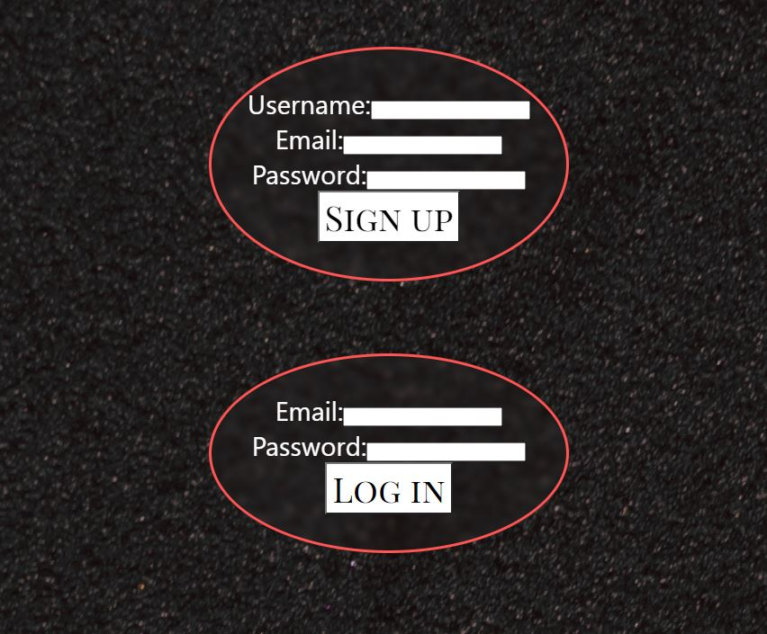
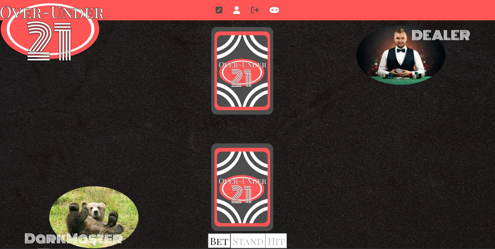
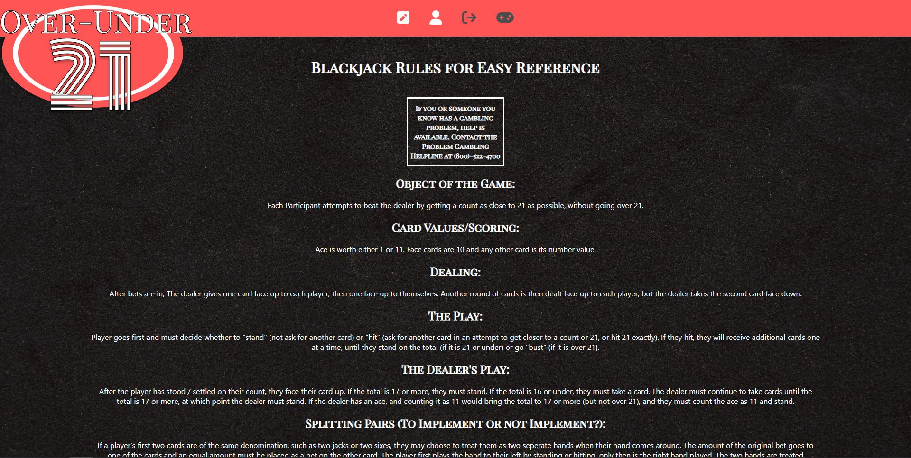
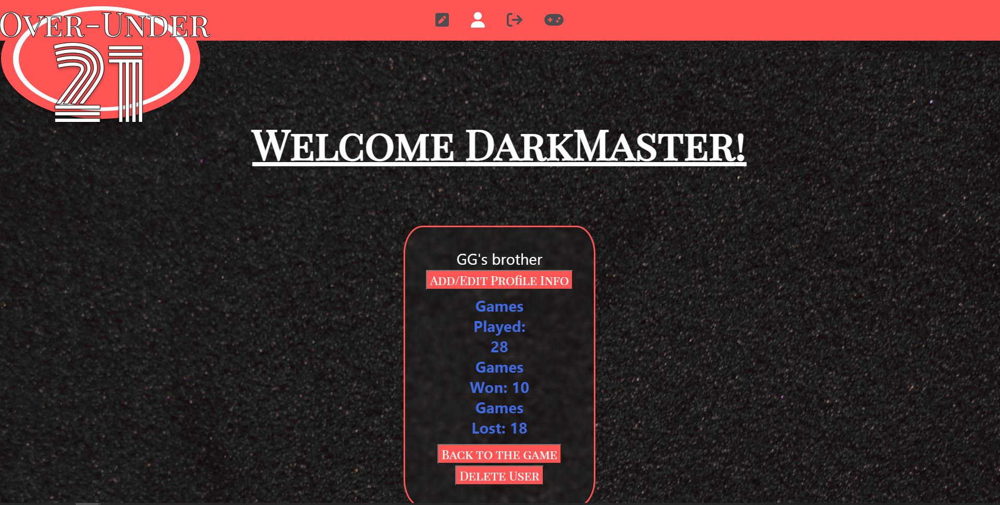

## Table of Contents: 
-[Descripition](#Description)
    -[Installation](#Installation)
    -[Usage](#Usage)
    -[Technologies](#Technologies)
    -[Contributions](#Contributions)
    
    
#  Title 
Over-Under21

##  Description
Over-Under21 is a fullstack web application that allows the users to play BlackJack the card game, create usernames, keep track of wins, losses, how many games the user has played and enter a brief description on their playstyle. Users must first sign up, then they will be able to login and begin playing. Here the user can see a header with options to view the rules of the game, see the users profile, logout, and return to the game. On the profile page, the user will be able to see their name, add/edit profile info, and see their stats uppdated in real time. In addition the user can return back to the game or delete their account entirely.

## Installation
To install this application follow these steps:

1. Clone the application from GitHub with:
* git clone [clone link from GitHub]

2. From the root folder, install the dependencies with:
 * npm install

3. Run the app with:
 * npm run develop

## Usage
Access the deployed application with the Heroku link:

## Technologies 

* GraphQL with a Node.js and Express.js server
* React
* Authentication (JWT)
* Dotenv
* Card Pack:
https://mreliptik.itch.io/playing-cards-packs-52-cards
* Background Image:
https://pixabay.com/photos/texture-velvet-color-texture-1355530/
* Dealer Image:
https://www.aceacademy.eu/blog/so-you-wanna-be-a-casino-dealer

## Contributions
* Anna https://github.com/annapng 
* David https://github.com/CaptureB 
* Katie https://github.com/KateRitchie 
* Jacob https://github.com/jpick77

